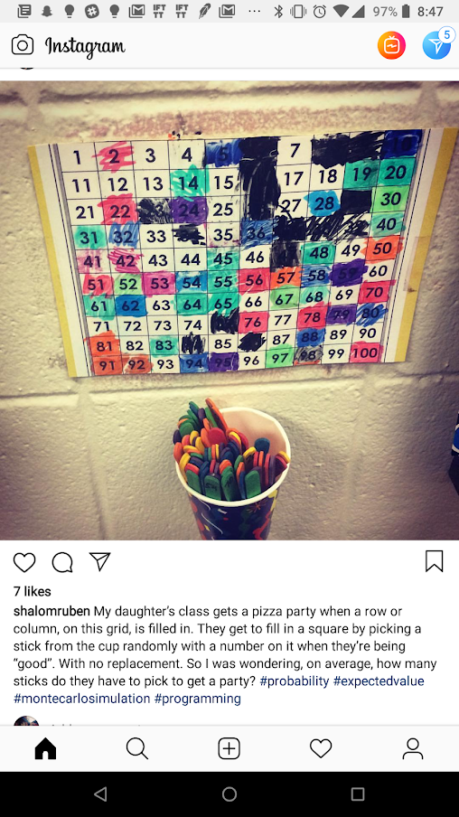

# popsicle-stick

This project was inspired by my professor [@shalomruben](https://www.instagram.com/shalomruben/). The image below is a screenshot of one of his instagram posts (below). The idea is that his daughter's class gets a pizza party when they fill in either an entire row or entire column of a 10x10 matrix. The question is, how many sticks on average do they need to draw in order to get a pizza party?

Using different methods, I hope to show an optimized Monte-Carlo solution to this problem.

